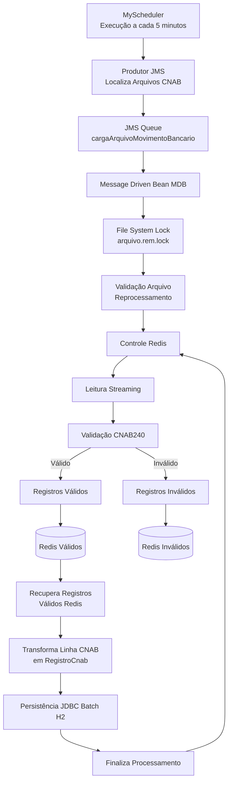
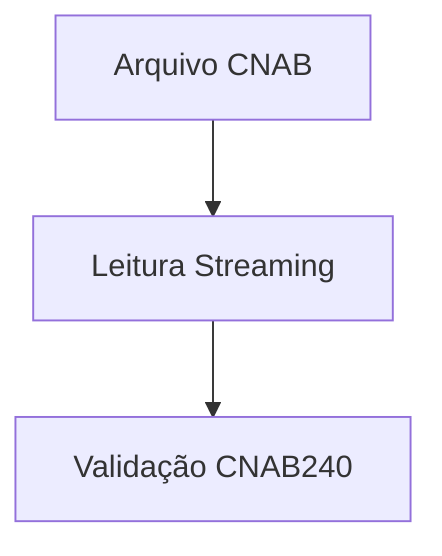
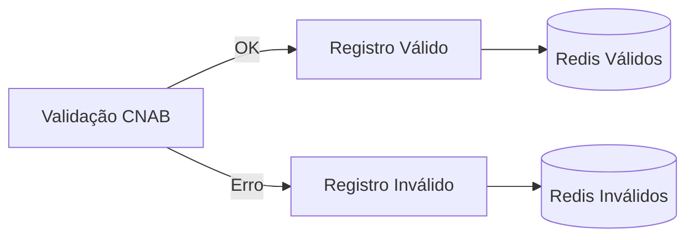
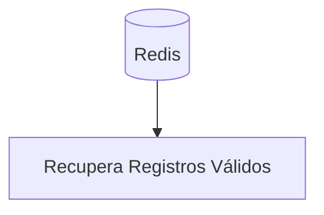
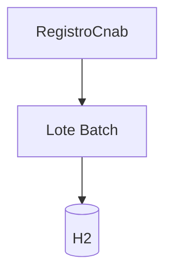
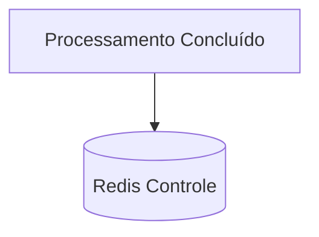
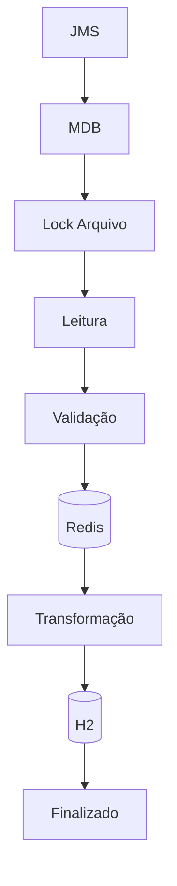

# Processamento de Arquivos CNAB

## Visão Geral

O processamento de arquivos CNAB foi projetado para operar de forma assíncrona utilizando JMS/MDB, garantindo:

* Processamento distribuído
* Controle de concorrência via File System Lock
* Persistência temporária em Redis
* Persistência final em banco H2 utilizando JDBC Batch
* Rastreabilidade completa do processamento
* Controle de reprocessamento
* Auditoria operacional

---

# Arquitetura Geral




---

# Fluxo Detalhado

## Etapa 01 - Recebimento da Mensagem

O processamento inicia quando uma mensagem é consumida da fila JMS.

```text
Fila JMS
    ↓
MDB
```

Responsabilidades:

* Receber solicitação de processamento
* Localizar arquivo CNAB
* Iniciar controle operacional

---

## Etapa 02 - Controle de Concorrência

Antes de iniciar o processamento é criado um lock físico.

```text
arquivo.rem.lock
```

Objetivos:

* Evitar processamento simultâneo do mesmo arquivo
* Proteger o ambiente contra duplicidade
* Garantir exclusividade durante a leitura

---

## Etapa 03 - Controle Operacional Redis

No início do processamento é criado um registro de controle.

### Chave

```text
movbancario:controle:<arquivo>
```

### Informações armazenadas

```text
status
inicio
fim
total
validos
invalidos
erro
```

---

## Etapa 04 - Leitura Streaming

O arquivo é processado linha a linha.



Benefícios:

* Baixo consumo de memória
* Arquivos grandes suportados
* Processamento contínuo

---

## Etapa 05 - Tratamento dos Registros



### Chaves Redis

Registros válidos:

```text
movbancario:validos:<arquivo>
```

Registros inválidos:

```text
movbancario:invalidos:<arquivo>
```

---

## Etapa 06 - Recuperação dos Registros

Após finalizar a leitura do arquivo:



Nesta etapa não há mais acesso ao arquivo físico.

---

## Etapa 07 - Transformação

Conversão da linha CNAB para objeto de domínio.


---

## Etapa 08 - Persistência JDBC Batch

Os registros são agrupados em lotes.



Configuração atual:

```text
BATCH_SIZE = 50
```

Benefícios:

* Menos round-trips ao banco
* Melhor performance
* Menor contenção de locks

---

## Etapa 09 - Finalização

Ao término:



Informações atualizadas:

```text
status = FINALIZADO
fim
total
validos
invalidos
tempo processamento
```

---

# Estrutura das Chaves Redis

## Controle

```text
movbancario:controle:<arquivo>
```

## Registros Válidos

```text
movbancario:validos:<arquivo>
```

## Registros Inválidos

```text
movbancario:invalidos:<arquivo>
```

---

# Benefícios da Arquitetura

## Processamento Assíncrono

```text
JMS + MDB
```

Permite escalabilidade horizontal.

---

## Controle de Concorrência

```text
File System Lock
```

Evita processamento simultâneo do mesmo arquivo.

---

## Persistência Temporária

```text
Redis
```

Permite:

* Auditoria
* Recuperação
* Reprocessamento
* Monitoramento

---

## Persistência Final

```text
H2 JDBC Batch
```

Reduz:

* Locks
* Tempo de transação
* Consumo de recursos

---

# Fluxo Resumido




---

# Configuração JVM Recomendada

## Java 8+

```bash
-Xms2g
-Xmx2g
-XX:+UseG1GC
-XX:+HeapDumpOnOutOfMemoryError
-XX:+PrintGCDetails
-XX:+PrintGCDateStamps
-Xloggc:/tmp/gc.log
```

---

# Explicação dos Parâmetros

| Parâmetro | Objetivo |
|---|---|
| `-Xms2g` | Heap inicial |
| `-Xmx2g` | Heap máximo |
| `-XX:+UseG1GC` | Garbage Collector G1 |
| `-XX:+HeapDumpOnOutOfMemoryError` | Gera heap dump automático em OOM |
| `-XX:+PrintGCDetails` | Log detalhado GC |
| `-XX:+PrintGCDateStamps` | Timestamp GC |
| `-Xloggc:/tmp/gc.log` | Arquivo log GC |

---

# Análise GC

## Ferramenta recomendada

GCViewer

https://github.com/chewiebug/GCViewer

---

# Execução GCViewer

```bat
java -jar gcviewer-1.36.jar
```

---

# Métricas Importantes

| Métrica | Esperado |
|---|---|
| Throughput JVM | > 95% |
| Full GC | mínimo |
| Pause Time | baixa |
| Heap After GC | estável |

---

# Geração Heap Dump Manual

## Descobrir PID JVM

```bash
jps -l
```

Exemplo:

```text
25816
```

---

# Gerar Heap Dump

```bat
jcmd 25816 GC.heap_dump C:\tmp\cnab-etl.hprof
```

---

# Quando Gerar o Dump

## Recomendado

Durante o processamento do ETL.

Objetivo:

- capturar objetos vivos
- identificar retenção memória
- analisar batches
- validar comportamento streaming

---

# Análise Heap Dump

## Ferramenta recomendada

Eclipse Memory Analyzer (MAT)

https://eclipse.dev/mat/

---

# Principais Análises MAT

## Leak Suspects Report

Identifica possíveis vazamentos memória.

---

## Dominator Tree

Mostra quem está retendo heap.

Ordenar por:

```text
Retained Heap
```

---

## Histogram

Mostra quantidade objetos:

- String
- byte[]
- ArrayList
- RegistroCnab

---

## Path to GC Roots

Mostra porque o objeto ainda está vivo.

---

# Comportamento Esperado do ETL

## Saudável

- heap estável
- objetos temporários
- GC funcionando
- baixa retenção memória
- streaming efetivo

---

# Possíveis Problemas

| Problema | Sintoma |
|---|---|
| List sem clear() | heap crescente |
| batch excessivo | Full GC |
| retenção DTO | Old Gen |
| cache excessivo | memória alta |
| duplicidade objetos | consumo heap |

---

# Estruturas Sensíveis do ETL

## Validar comportamento:

- blocoRedis
- lote
- RegistroCnab
- String CNAB
- buffers JDBC

---

# Estratégia Atual do ETL

- processamento streaming
- batch JDBC
- persistência temporária Redis
- controle duplicidade Redis
- separação registros inválidos
- baixo consumo memória
- fail-fast validação
- preservação ordem CNAB

---

# Ferramentas Recomendadas

| Ferramenta | Objetivo |
|---|---|
| VisualVM | monitoramento realtime |
| GCViewer | análise GC |
| MAT | análise heap dump |
| JMC/JFR | profiling produção |

---

# Observação

Para ETL CNAB com grandes volumes:

- evitar carregar arquivo completo memória
- evitar listas gigantes
- utilizar batch controlado
- monitorar Full GC
- validar retenção objetos
- manter processamento streaming