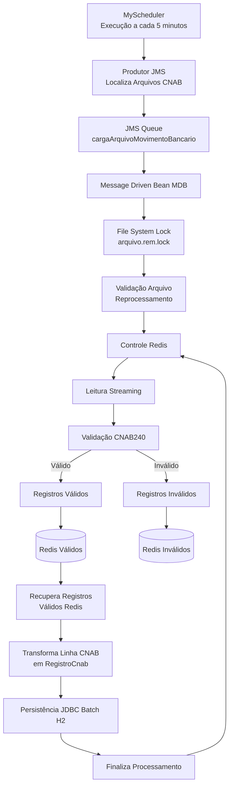

# Processamento de Arquivos CNAB

## Visão Geral

O processamento de arquivos CNAB foi projetado para operar de forma assíncrona utilizando JMS/MDB, garantindo:

* Processamento distribuído
* Controle de concorrência via File System Lock
* Persistência temporária em Redis
* Persistência final em banco H2 utilizando JDBC Batch
* Rastreabilidade completa do processamento
* Controle de reprocessamento
* Auditoria operacional

---

# Arquitetura Geral

---

jdbc:h2:file:c:/tmp/movbancario/movbancario

<datasource jndi-name="java:jboss/datasources/ExampleDS" pool-name="ExampleDS" enabled="true" use-java-context="true">
    <connection-url>jdbc:h2:mem:test;DB_CLOSE_DELAY=-1;DB_CLOSE_ON_EXIT=FALSE</connection-url>
    <driver>h2</driver>
    <security>
        <user-name>sa</user-name>
        <password>sa</password>
    </security>
</datasource>
<datasource jndi-name="java:/jdbc/MovBancarioDS" pool-name="MovBancarioDS" enabled="true" use-java-context="true">
    <connection-url>jdbc:h2:file:/tmp/movbancario/movbancario;MULTI_THREADED=TRUE</connection-url>
    <driver>h2</driver>
    <security>
        <user-name>sa</user-name>
        <password>sa</password>
    </security>
</datasource>

